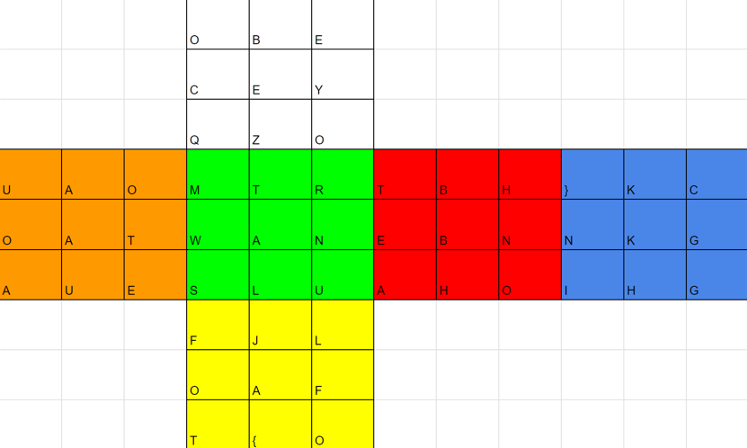
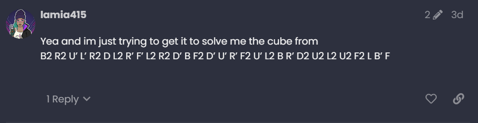
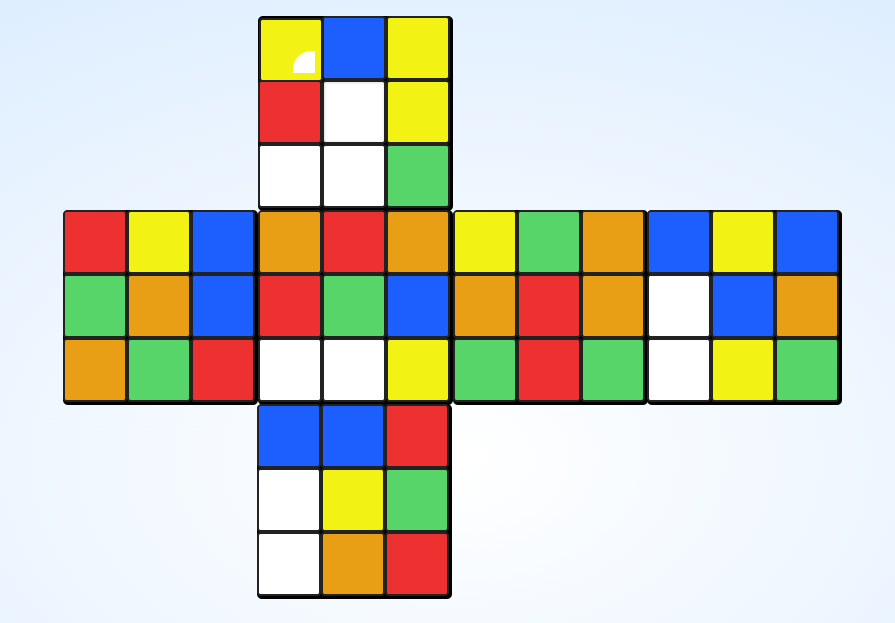
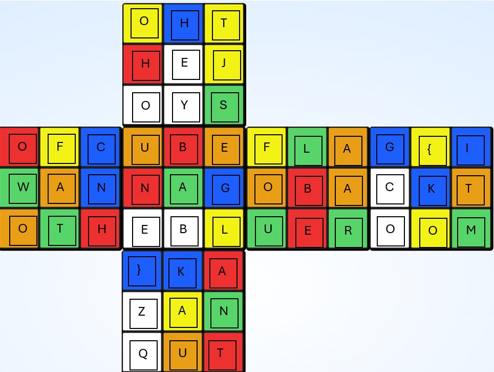

This crypto challenge from DeadFace CTF 2024 involved a picture of a solved rubik's cube layout. 

Each square is assigned a letter, representing a scrambled flag. 
The encryption algorithm was cearly going to be some scramble such that the letters arranged to make a coherent flag. The challenge description mentioned that the picture came from communication between "deephax and mirveal". When we look into the GhostTown website and search for deephax, one of the threads included is 
"AI Assistants: Game-Changer or Overhyped?". In this thread there is a message from Iamia415 that reveals the necessary rubik's cube scramble: 

With this information the solve becomes pretty trivial. The notation "B2 R2 U’ L’ R2 D L2 R’ F’ L2 R2 D’ B F2 D’ U’ R’ F2 U’ L2 B R’ D2 U2 L2 U2 F2 L B’ F" represents WCA turning notation, telling us how the cube was scrambled. I plugged this into https://rubikscu.be/ to get the flattened layout

From here we just match up the pieces on the scrambled cube with the pieces on the original picture and give them the assigned letter. 

The descrambled text reveals "flag{iwannagobacktotheblueroom}"
